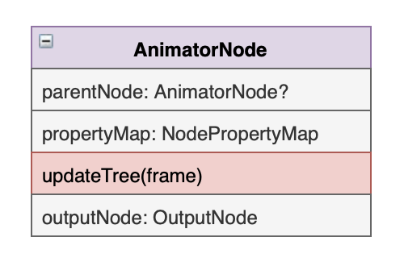
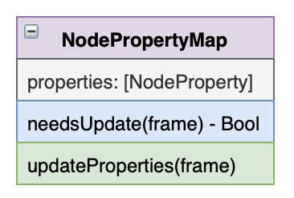
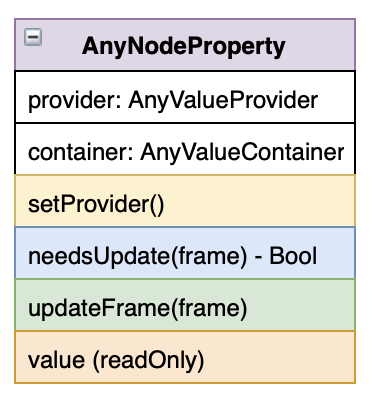
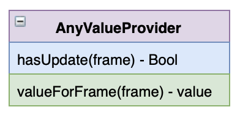
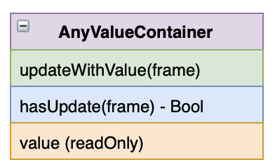
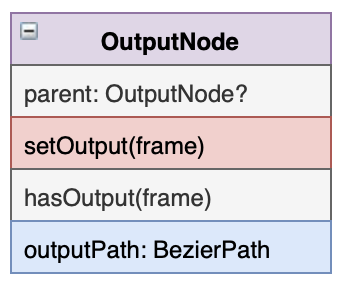
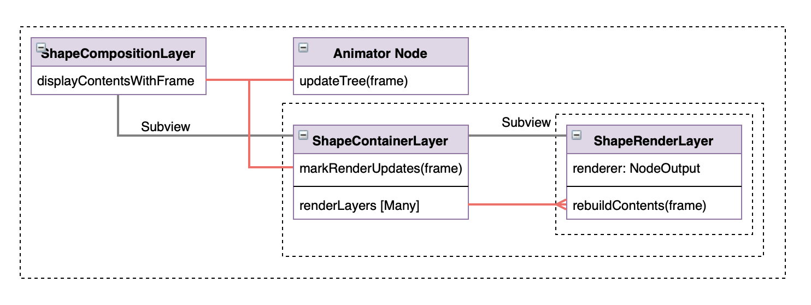
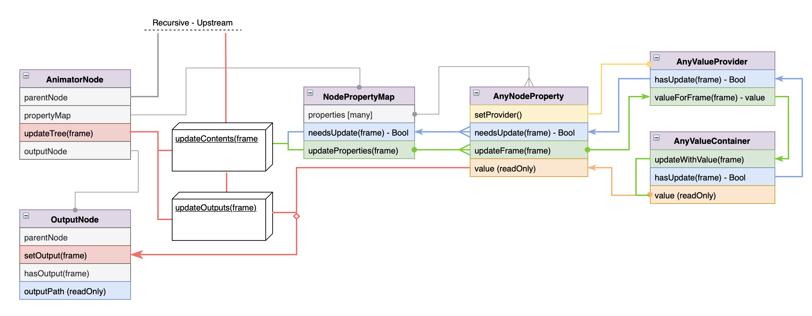

# Lottie-iOS Render System Documentation

The purpose of this document is to explain how Lottie's render system works. 

For questions reach out to the author: [Brandon Withrow](https://twitter.com/theWithra)

## Check Before Submitting

Before submitting a PR to Lottie please run through the following checklist.

 - Run 'pod install' in `/Example`
 - Ensure that all targets in `/Example/lottie-swift.xcworkspace` build
 - Add any new files to all of the targets in `/Lottie.xcodeproj`
 - Ensure that all targets build in `/Lottie.xcodeproj`
 
  After making a PR please watch for PR notifications. We will run a series of tests on the PR to ensure that it does not break existing animations.
  
  NOTE: PRs must be approved by the Maintainer of Lottie-ios before they can be merged.

## Project Structure

Lottie is available on iOS and MacOS via CocoaPods, NPM, and Carthage. Because of this, there are some things to consider when adding files to the project. All of the under-the-hood code in Lottie is written to compile in all environments. Specialty wrappers for both `iOS` and `MacOS` are written to give access to Lottie in each environment. These wrappers are designed to be as thin as possible, to avoid code fragmentation.

For example, `UIKit` is only available on iOS, whereas MacOS uses `AppKit`.

### Source Code Directory Structure
All of the source code for Lottie is located in `/lottie-swift/src` in the repo. Here's a quick run down of the directory structure:

 - `src`: The Root directory for all Lottie source files
	 - `Public`: Public facing files.
		 - `Animation`: Files relating to `Animation` and `AnimationView`. *Files in this directory are complied on both iOS and MacOS.*
		 - `AnimationCache`: Files relating to `AnimationCache`. *Files in this directory are complied on both iOS and MacOS.*
		 - `DynamicProperties`: All public facing files relating to the Dynamic Properties API. *Files in this directory are complied on both iOS and MacOS.*
		 - `ImageProvider`: Holds the `ImageProvider` protocol. *Files in this directory are complied on both iOS and MacOS.*
		 - `MacOS`: Files that are **only** compiled for MacOS. *Files in this directory are complied on MacOS.*
		 - `Primitives`: Primitive data structures. *Files in this directory are complied on both iOS and MacOS.*
		 - `iOS`: Files that are **only** compiled for iOS. *Files in this directory are complied on iOS.*
	 - `Private`: Private `internal` files. *Files in this directory are complied on both iOS and MacOS.*

### Adding a file to the project.

Because Lottie supports multiple distributions/platforms, adding a file to the project takes a couple of steps.

1. Add the new source file into the appropriate directory. Think about the new source file's purpose and what platform it will be available on.
2. After adding the new file, test that it can install and compile with CocoaPods. Navigate to `/Example` in terminal and run `pod install`. Afterwards open [lottie-swift.xcworkspace](/Example/lottie-swift.xcworkspace "lottie-swift.xcworkspace") and build all of the target platforms to ensure that nothing is broken.
3. Add the files to the Carthage build. Open [Lottie.xcodeproj](/Lottie.xcodeproj "Lottie.xcodeproj"). Add the new file to the project. **Uncheck Copy File when adding new files to this project**.  Check the files Target Membership in the right panel and make sure it is added to the appropriate targets. There are two targets, on dynamic and one static, for each platform (iOS, tvOS, macOS). After adding the targets run through and build all of the targets.
4. Celebrate! You've done it!

## After Effects Primer
Before digging into Lottie, let's take a look at how After Effects builds animation. Lottie structures a lot of its render system in a similar way to After Effects.

### Layers
An After Effects `Composition` is a top level object that holds an animation timeline and several `Layers`. These `Layers` are different from Layers in iOS, which can describe any rendered frame. A `Layer` is more of a top level container, that holds its contents and can transform it. There are a couple of types of `Layer`, each with it's own unique contents. They are:

- `Image layer`: Contains an image and a `Transform`
- `Null Layer`: Contains only a`Transform`
- `Shape Layer`: Contains a group of `Shape Objects`
- `Solid Layer`: Contains a colored rectangle
- `Text Layer`: Contains rendered `Text`
- `Precomp Layer`: Contains another composition, with its own group of `Layers`

A `Composition` has a timeline, and almost every property in After Effects can be keyframed to change over time. As the current time on a timeline is changed every property with keyframe data is interpolated and updated, creating animation.

Each `Layer` has a `Transform` which transforms the layer's contents in space. A `Transform` can position, rotate, scale, skew, and change the opacity of a layer's contents. Each of these properties can be animated.

`Layers` can be parented to another layer. A layer is affect not only by it's own `Transform` but also by its `Parent`. `Layers` also each hold a list of `Masks` that affect their appearance. `Masks` are bezier shape paths that are used to cut out portions of the layer.

### Shape Layers
The `Shape Layer` is the bread and butter of Lottie. A `Shape Layer` can hold several `Shape Objects`. You can think of a `Shape Object` as a single render instruction. At render time, each `Shape Object` is read in order and together create a rendering on screen.  Each `Shape Object` has its own list of animatable properties that defines it's output. There are three basic classes of `Shape Objects`, each with a handful of subtypes.

- **Path Generators**: Create bezier path data to be rendered and adds it to the current state. Some path generators are `Ellipse` `Rect` `Polystar`

- **Modifiers**: Alters bezier path data from the current state. Some Modifiers are `Trim Path` `Merge Path` `Transform Path`

- **Renderers**: Renders the current bezier path data on screen. Some Renderers are `Fill Path` `Stroke path`

A set of `Shape Objects` are held in a `Group`, which can be nested inside other `Groups`. A `Shape Layer` can hold an unlimited number of `Shape Objects`

## Lottie's Node System

The simplest way to recreate After Effects' render system would be to nest all of the render instruction into a `CALayer` and have the layer draw it's contents. This wouldn't be very performant however, as a layer would have to redraw it's entire contents if there was even the slightest of updates. In fact this is how After Effects works, each frame is entirely redrawn when anything changes. After Affects can afford to work this way, as it is not a realtime renderer.

Lottie works in a different way. Every renderable instruction is nested in it's own `CALayer`.  Every frame a `Node Tree` determines which properties have updates, and only updates the affected layers. If a renderer doesn't have any updates, it is not redrawn. This greatly improves performance and allows for realtime rendering of animations.

The Node System is designed to efficiently updates render contents. Additionally the Node System was designed to be as clean and composable as possible.

### Animator Node



The `Animator Node` is a protocol that defines an object with a group of animatable properties. Every `Shape Object` is an `Animator Node`.  A `Shape Layer` holds a linked-list tree of `Animator Nodes` that it updates each frame. `Animator Nodes` are not directly responsible for rendering on screen, they are only responsible for checking for updates and building the data used for rendering. 

An `Animator Node` will build it's output and put it into an `Output Node`. This node is later referenced by a `ShapeRenderLayer` which is responsible for rendering the output.

Every frame a `Shape Layer` asks it's root `Animator Node` to update. The `Animator Node` check's if it has any updates, updates its properties if necessary, and then recursively updates it's parent `Animator Node`. If an `Animator Node` has any updates it will rebuild its outputs, and mark them as updates. At render time anything marked with an update is rendered.

### Node Property Map



An `Animator Node` holds reference to a `Node Property Map`. The `Node Property Map` holds a list of `Node Property` objects, and is responsible for updating them each frame. Additionally the `Node Property Map` can map to its `Node Property` objects by a key.

### Node Property



A `Node Property` holds both a `Value Provider` and a `Value Container`. During an update the `Node Property` will ask the `Value Provider` if it has an update. If it does the `Node Property` will get the new value from the `Value Provider` and store it in the `Value Container`. The property and the container will be marked as having an update.

Additionally, the `Value Provider` of a `Node Property` can be dynamically changed, allowing animations to be altered at runtime.

### Value Provider



The `Value Provider` protocol defines a handful of methods for retrieving a typed value over time. Each frame a `Value Provider` is asked if it has an update, and then is asked for it's value.

A `Value Provider` can be a list of keyframes that interpolates over time, a single unchanging value, or a dynamic object that is changed from outside of Lottie.

### Value Container



The `Value Container` holds reference to a single output value. The node is marked if it has been updated, and can be references from many sources. Ultimately an `Animator Node` will read the value from the container and build its output.

### Output Node



The `Output Node` holds reference to the final output of an `Animator Node`. `Output Node` objects are linked together into their own tree that is held by the render layers. After the `Animator Node` tree is updated the `Output Node` tree is used by the render layers to redraw it's contents. Every `Output Node` has a parent node and an `outputPath`. The `outputPath` is the sum of its parent's output and its out data.

An `Output Node` generally falls into one of three types, which match the three classes of `Shape Objects` in After Effects.

- `Path Output Node`: Holds a generated bezier path
- `Path Modifier`: Modifies its input path and set the output.
- `Renderer`: Holds instructions for rendering the current path data.


## The Update Cycle



A `ShapeCompositionLayer` is a top level `CALayer` that holds a `Node Tree` and a `Render Container`. Each frame of animation the `ShapeCompositionLayer` is given a frame. Render updates happen in two passes: 
 1. The Node Tree is updated
 2. The child Render Layers are updated. 




*The Animator Node update cycle*

This is the update cycle for a single `Animator Node`. When the `ShapeCompositionLayer` receives a frame it tells its root `Animator Node` to update with the frame. The `Animator Node` calls recursively upstream to start updates at the top of the tree. An `Animator Node` asks its `Node Property Map` if there are updates. The property map holds a list of `Node Property` objects. Each one is asked if it has an update. That call is passed through to the `Value Provider`, and also the `Value Container` if either return `true` then the property is marked for update. Next the `Node Property Map` loops through its properties and asks them to update if necessary. The `Node Property` asks its `Value Provider` for its value and then stores it in the `Value Container`.

After all of the `Node Properties` have updates the `Animator Node` passes its update state down stream. Once the entire tree has updated its properties it starts to rebuild its outputs. Outputs are rebuilt from the bottom of the tree up to the top. If an `Animator Node` was marked as updated during its update pass it rebuilds its output. `updateOutputs` is called. Here an `Animator Node` executes its custom code for building its outputs. It reads the values of its properties `Value Container` and builds the output that is stored in its `Output Node`. Afterwards it calls up the tree to continue the update process.

Once all of the nodes have marked themselves, and updated their outputs, the `ShapeCompositionLayer` moves on to the render side of the update.


*The Render Node update cycle*

The `Shape Composition Layer` tells it's `Shape Container Layer` to mark it's updates. The `Shape Container Layer` loops through its child `Shape Render Layers`.

Each `Shape Render Layer` holds reference to a `Renderer`. A `Renderer` is a type of `Output Node` that has render instructions in addition to an `outputPath`. The `Shape Render Layer` asks its renderer if there are updates for the frame. If the renderer returns `true` the `Shape Render Layer` calls `setNeedsDisplay` on itself which loops into `CALayer` update system. 

When `display` is called on the `Shape Render Layer` it asks its render for render instructions and the layer is redrawn.

🎉🎉🎉

## Current Animator Nodes

### Modifier Nodes
- `TrimPathNode`: Trims a collection of paths by a percentage of their length
### Render Nodes
- `FillNode`: Fills all input paths with a solid color
- `StrokeNode`: Strokes all input paths with a solid color
- `GradientFillNode`: Fills all input paths with a gradient color
- `GradientStrokeNode`: Strokes all input paths with a gradient color
### Path Nodes
- `EllipseNode`: Generates an Ellipse Path
- `PolygonNode`: Generates a Polygon Path with N sides
- `RectNode`: Generates an Rectangular Path
- `ShapeNode`: Generates an Path with bezier path data
- `StarNode`: Generates an Star Path
### Container Nodes
- `GroupNode`: Holds and renders a group of node objects
### Specialty Nodes
- `TransformNode`: Supplies top level Layers with transforms
- `TextAnimatorNode`: Supplies a Text Layer with its text contents

## Example Animator Node

For example, let us implement one of the simplest `Animator Nodes`, the `Fill Node`. 

The `Fill Node` is a node that renders a filled shape with a solid color.  It only has a few properties: `color` `opacity` and `fillRule`. 

An `Animator Node` has a `Node Property Map` that maps its properties. Lets create a property map fot the `Fill Node`:

```swift
class FillNodeProperties: NodePropertyMap, KeypathSearchable {

	var keypathName: String
	
	init(fill: Fill) {
		/// The node is initialized with a `Fill` model.
		self.keypathName = fill.name
		/// Create a Node Property with a group of Color Keyframes
		self.color = NodeProperty(provider: KeyframeInterpolator(keyframes: fill.color.keyframes))
		/// Create a Node Property with a group of Float Keyframes
		self.opacity = NodeProperty(provider: KeyframeInterpolator(keyframes: fill.opacity.keyframes))
		/// Set the fill rule.
		self.type = fill.fillRule
		/// Make a key map of the properties, enabling dynamic property setting.
		self.keypathProperties = [
			"Opacity" : opacity,
			"Color" : color
		]
		/// Set the properties.
		self.properties = Array(keypathProperties.values)
	}

	let opacity: NodeProperty<Vector1D>
	let color: NodeProperty<Color>

	let type: FillRule

	let keypathProperties: [String : AnyNodeProperty]
	let properties: [AnyNodeProperty]

}
```

Now we have created a robust property map for our Fill Node.
An `Animator Node` also needs an `OutputNode`. The Fill Node has a Renderer output type, that renders path objects with a fill. Let's create the Renderer `OutputNode`
```Swift
/// An OutputNode that holds render instructions for Fill
class FillRenderer: PassThroughOutputNode, Renderable {

	/// A Render Node can either update a CAShapeLayer, or render directly into a context.
	/// This node can accomplish its rendering with a CAShapeLayer
	let shouldRenderInContext: Bool = false
	
	/// Output Node Properties. Notice how setting these properties sets hasUpdate to `true`
	
	/// The fill color.
	var color: CGColor? {
		didSet {
			hasUpdate = true
		}
	}
	
	/// The fill opacity.
	var opacity: CGFloat = 0 {
		didSet {
			hasUpdate = true
		}
	}

	//// The fill rule.
	var fillRule: FillRule = .none {
		didSet {
			hasUpdate = true
		}
	}

	/// The function that is called when render updates happen.
	func updateShapeLayer(layer: CAShapeLayer) {
		layer.fillColor = color
		layer.opacity = Float(opacity)
		layer.fillRule = fillRule.caFillRule
		/// Clear the update flag. The job is done.
		hasUpdate = false
	}
	
	/// Optional, the context renderer. 
	/// setting shouldRenderInContext to `true` would cause this method to be called.
	func render(_ inContext: CGContext) {
		guard inContext.path != nil && inContext.path!.isEmpty == false else {
			return
		}
		guard let color = color else { return }
		hasUpdate = false
		inContext.setAlpha(opacity * 0.01)
		inContext.setFillColor(color)
		inContext.fillPath(using: fillRule.cgFillRule)
	}
}
```

Now we have a `Renderer` `OutputNode` capable of rendering a fill. We are now ready to create our `FillNode`

```swift

/// An `Animator Node` capable of fill rendering.
class FillNode: AnimatorNode, RenderNode {
	
	/// The fill renderer.
	let fillRender: FillRenderer
	
	/// Protocol RenderNode requires a `Renderable`
	var renderer: NodeOutput & Renderable {
		return  fillRender
	}

	/// The Fill properties.
	let fillProperties: FillNodeProperties

	/// Initialized with a `Fill` model.
	init(parentNode: AnimatorNode?, fill: Fill) {
		/// Create the Renderer
		self.fillRender = FillRenderer(parent: parentNode?.outputNode)
		/// Create the Properties
		self.fillProperties = FillNodeProperties(fill: fill)
		/// Set the upstream parent node.
		self.parentNode = parentNode
	}

	// MARK: Animator Node Protocol
	
	var propertyMap: NodePropertyMap & KeypathSearchable {
		return  fillProperties
	}

	let parentNode: AnimatorNode?
	var hasLocalUpdates: Bool = false
	var hasUpstreamUpdates: Bool = false
	var lastUpdateFrame: CGFloat? = nil
	
	/// Changes to this node do not affect downstream nodes.
	func localUpdatesPermeateDownstream() -> Bool {
		return  false
	}
	
	/// Set up the renderer.
	func rebuildOutputs(frame: CGFloat) {
		fillRender.color = fillProperties.color.value.cgColorValue
		fillRender.opacity = fillProperties.opacity.value.cgFloatValue * 0.01
		fillRender.fillRule = fillProperties.type
	}

}
```

And that's that!
Now, when connected to a Node Tree, the fill node will render its contents only when its contents, or its upstream nodes, have updated.


<!--stackedit_data:
eyJoaXN0b3J5IjpbNDAyMzc2OTcwLC02MjE5NjI3MDEsMTg0OT
c1ODQ2Niw0ODc1MjM0NzAsLTEwNzk3Mjk1NzksLTE5Mjc4OTQ3
OTEsMTg1MDI5NDQyNywxNTI2MjA4OTY3LC01Mzg5NzExMjIsLT
gyNzI5NjA5NSwtMTk3ODAwNjA4NywzNjU5MjYzMDBdfQ==
-->
