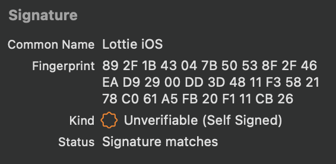

# Lottie for iOS
 [](https://cocoapods.org/pods/lottie-ios) [](https://github.com/Carthage/Carthage) [](https://swift.org/package-manager/) [](https://cocoapods.org/pods/lottie-ios) [](https://swiftpackageindex.com/airbnb/lottie-ios) [](https://swiftpackageindex.com/airbnb/lottie-ios)

**View documentation, FAQ, help, examples, and more at [airbnb.io/lottie](https://airbnb.io/lottie/)**

Lottie is a cross-platform library for iOS, macOS, tvOS, visionOS, [Android](https://github.com/airbnb/lottie-android), and [Web](https://github.com/airbnb/lottie-web) that natively renders vector-based animations and art in realtime with minimal code.

Lottie loads and renders animations and vectors exported in the bodymovin JSON format. Bodymovin JSON can be created and exported from After Effects with [bodymovin](https://github.com/bodymovin/bodymovin), Sketch with [Lottie Sketch Export](https://github.com/buba447/Lottie-Sketch-Export), and from [Haiku](https://www.haiku.ai).

Designers can create **and ship** beautiful animations without an engineer painstakingly recreating them by hand.
Since the animations are backed by JSON, they are extremely small in size but can be large in complexity!
Animations can be played, resized, looped, sped up, slowed down, reversed, and even interactively scrubbed.
Lottie can play or loop just a portion of the animation as well, the possibilities are endless!
Animations can even be ***changed at runtime*** in various ways! Change the color, position, or any keyframable value!

Here is just a small sampling of the power of Lottie


## Installing Lottie
Lottie supports [Swift Package Manager](https://www.swift.org/package-manager/), [CocoaPods](https://cocoapods.org/), and [Carthage](https://github.com/Carthage/Carthage) (Both dynamic and static).

### Github Repo

You can pull the [Lottie Github Repo](https://github.com/airbnb/lottie-ios/) and include the `Lottie.xcodeproj` to build a dynamic or static library.

### Swift Package Manager

To install Lottie using [Swift Package Manager](https://github.com/apple/swift-package-manager) you can follow the [tutorial published by Apple](https://developer.apple.com/documentation/xcode/adding_package_dependencies_to_your_app) using the URL for the Lottie repo with the current version:

1. In Xcode, select “File” → “Add Packages...”
1. Enter https://github.com/airbnb/lottie-spm.git

or you can add the following dependency to your `Package.swift`:

```swift
.package(url: "https://github.com/airbnb/lottie-spm.git", from: "4.4.1")
```

When using Swift Package Manager we recommend using the [lottie-spm](https://github.com/airbnb/lottie-spm) repo instead of the main lottie-ios repo.  The main git repository for [lottie-ios](https://github.com/airbnb/lottie-ios) is somewhat large (300+ MB), and Swift Package Manager always downloads the full repository with all git history. The [lottie-spm](https://github.com/airbnb/lottie-spm) repo is much smaller (less than 500kb), so can be downloaded much more quickly. 

Instead of downloading the full git history of Lottie and building it from source, the lottie-spm repo just contains a pointer to the precompiled XCFramework included in the [latest lottie-ios release](https://github.com/airbnb/lottie-ios/releases/latest) (typically ~8MB). If you prefer to include Lottie source directly your project, you can directly depend on the main lottie-ios repo by referencing `https://github.com/airbnb/lottie-ios.git` instead.

### CocoaPods
Add the pod to your Podfile:
```ruby
pod 'lottie-ios'
```

And then run:
```ruby
pod install
```
After installing the cocoapod into your project import Lottie with
```swift
import Lottie
```

### Carthage
Add Lottie to your Cartfile:
```
github "airbnb/lottie-ios" "master"
```

And then run:
```
carthage update
```
In your application targets “General” tab under the “Linked Frameworks and Libraries” section, drag and drop lottie-ios.framework from the Carthage/Build/iOS directory that `carthage update` produced.

## Swift Version Support

Lottie supports Swift / Xcode versions back to the minimum version that is permited by Apple for submissions to the App Store. You can see the most up-to-date information for which Swift versions Lottie supports on [Swift Package Index](https://swiftpackageindex.com/airbnb/lottie-ios):

[](https://swiftpackageindex.com/airbnb/lottie-ios)

## Privacy

Lottie does not collect any data. We provide this notice to help you fill out [App Privacy Details](https://developer.apple.com/app-store/app-privacy-details/). We additionally provide a [privacy manifest](https://github.com/airbnb/lottie-ios/blob/master/Sources/PrivacyInfo.xcprivacy) which can be included in your app.

## Security

We distribute XCFramework bundles for each release on [GitHub](https://github.com/airbnb/lottie-ios/releases/latest). In Lottie 4.4.0 and later, these XCFramework bundles include a [code signature](https://developer.apple.com/documentation/xcode/verifying-the-origin-of-your-xcframeworks). These bundles are self-signed under the name "Lottie iOS" and have the following fingerprint:

```
89 2F 1B 43 04 7B 50 53 8F 2F 46 EA D9 29 00 DD 3D 48 11 F358 21 78 C0 61 A5 FB 20 F1 11 CB 26
```

In Xcode you can verify this by selecting `Lottie.xcframework` and confirming that it shows the following information:



## Contributing

We always appreciate contributions from the community. To make changes to the project, you can clone the repo and open `Lottie.xcworkspace`. This workspace includes:
 - the Lottie framework (for iOS, macOS, and tvOS)
 - unit tests and snapshot tests (for iOS, must be run on an iPhone 8 simulator)
 - an Example iOS app that lets you browse and test over 100 sample animations included in the repo

All pull requests with new features or bug fixes that affect how animations render should include snapshot test cases that validate the included changes. 
  - To add a new sample animation to the snapshot testing suite, you can add the `.json` file to `Tests/Samples`. Re-run the snapshot tests to generate the new snapshot image files.
  - To update existing snapshots after making changes, you can set `isRecording = true` in `SnapshotTests.swift` `setUp()` method and then re-run the snapshot tests.

The project also includes several helpful commands defined in our [Rakefile](https://github.com/airbnb/lottie-ios/blob/master/Rakefile). To use these, you need to install [Bundler](https://bundler.io/):

```bash
$ sudo gem install bundle
$ bundle install
```

For example, all Swift code should be formatted according to the [Airbnb Swift Style Guide](https://github.com/airbnb/swift). After making changes, you can reformat the code automatically using [SwiftFormat](https://github.com/nicklockwood/SwiftFormat) and [SwiftLint](https://github.com/realm/SwiftLint) by running `bundle exec rake format:swift`. Other helpful commands include:

```bash
$ bundle exec rake build:all # builds all targets for all platforms
$ bundle exec rake build:package:iOS # builds the Lottie package for iOS
$ bundle exec rake test:package # tests the Lottie package
$ bundle exec rake format:swift # reformat Swift code based on the Airbnb Swift Style Guide
```
