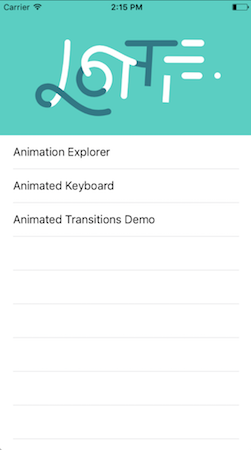
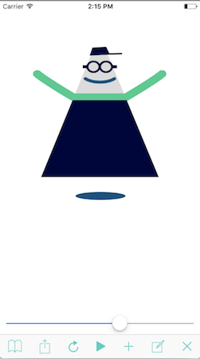
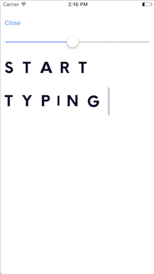
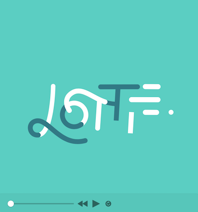
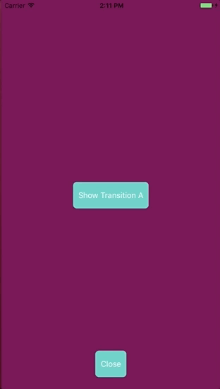
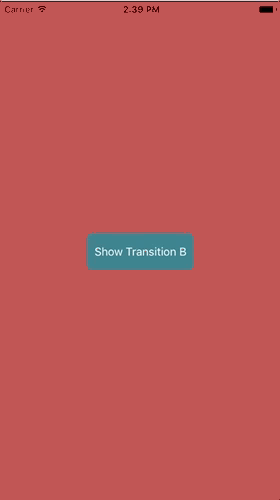

# Lottie for iOS, MacOS (and [Android](https://github.com/airbnb/lottie-android) and [React Native](https://github.com/airbnb/lottie-react-native))

### Table of Contents
- [Introduction](#introduction)
- [Installing Lottie](#installing-lottie)
- [iOS Sample App](#ios-sample-app)
- [MacOS Sample App](#macos-sample-app)
- [Objective C Examples](#objective-c-examples)
- [Swift Examples](#swift-examples)
- [Debugging Lottie](#debugging)
- [iOS View Controller Transitioning](#ios-view-controller-transitioning)
- [Changing Animations At Runtime](#changing-animations-at-runtime)
- [Supported After Effects Features](#supported-after-effects-features)
- [Currently Unsupported After Effects Features](#currently-unsupported-after-effects-features)
- [Community Contributions](#community-contributions)
- [Alternatives](#alternatives)
- [Why is it called Lottie?](#why-is-it-called-lottie)
- [Contributing](#contributing)
- [Issues or feature requests?](#issues-or-feature-requests)


## Introduction

Lottie is a mobile library for Android and iOS that parses [Adobe After Effects](http://www.adobe.com/products/aftereffects.html) animations exported as json with [bodymovin](https://github.com/bodymovin/bodymovin) and renders the vector animations natively on mobile and through React Native!

For the first time, designers can create **and ship** beautiful animations without an engineer painstakingly recreating it by hand.
Since the animation is backed by JSON they are extremely small in size but can be large in complexity!
Animations can be played, resized, looped, sped up, slowed down, reversed, and even interactively scrubbed.
Lottie can play or loop just a portion of the animation as well, the possibilities are endless!
Animations can even be ***changed at runtime*** in various ways! Change the color, position or any keyframable value!
Lottie also supports native UIViewController Transitions out of the box!

Here is just a small sampling of the power of Lottie


## Installing Lottie

### Github Repo
You can pull the [Lottie Github Repo](https://github.com/airbnb/lottie-ios/) and include the Lottie.xcodeproj to build a dynamic or static library.

### Cocoapods
Get [Cocoapods](https://cocoapods.org/)
Add the pod to your podfile
```
pod 'lottie-ios'
```
run
```
pod install
```

After installing the cocoapod into your project import Lottie with
Objective C
`#import <Lottie/Lottie.h>` 
Swift
`import Lottie`

### Carthage
Get [Carthage](https://github.com/Carthage/Carthage)

Add Lottie to your Cartfile
```
github "airbnb/lottie-ios" "master"
```
run
```
carthage update
```

In your application targets “General” tab under the “Linked Frameworks and Libraries” section, drag and drop lottie-ios.framework from the Carthage/Build/iOS directory that `carthage update` produced.

## iOS Sample App

Clone this repo and try out [the Sample App](https://github.com/airbnb/lottie-ios/tree/master/Example)
The repo can build a MacOS Example and an iOS Example

The iOS Example App demos several of the features of Lottie




The animation Explorer allows you to scrub, play, loop, and resize animations.
Animations can be loaded from the app bundle or from [Lottie Files](http://www.lottiefiles.com) using the built in QR Code reader.

## MacOS Sample App

Clone this repo and try out [the Sample App](https://github.com/airbnb/lottie-ios/tree/master/Example)
The repo can build a MacOS Example and an iOS Example



The Lottie Viewer for MacOS allows you to drag and drop JSON files to open, play, scrub and loop animations. This app is backed by the same animation code as the iOS app, so you will get an accurate representation of Mac and iOS animations.


## Objective C Examples


Lottie animations can be loaded from bundled JSON or from a URL
To bundle JSON just add it and any images that the animation requires to your target in xcode.

```objective-c
LOTAnimationView *animation = [LOTAnimationView animationNamed:@"Lottie"];
[self.view addSubview:animation];
[animation playWithCompletion:^(BOOL animationFinished) {
// Do Something
}];
```

If you are working with multiple bundles you can use.

```objective-c
LOTAnimationView *animation = [LOTAnimationView animationNamed:@"Lottie" inBundle:[NSBundle YOUR_BUNDLE]];
[self.view addSubview:animation];
[animation playWithCompletion:^(BOOL animationFinished) {
// Do Something
}];
```

Or you can load it programmatically from a NSURL
```objective-c
LOTAnimationView *animation = [[LOTAnimationView alloc] initWithContentsOfURL:[NSURL URLWithString:URL]];
[self.view addSubview:animation];
```

Lottie supports the iOS `UIViewContentModes` aspectFit, aspectFill and scaleFill

You can also set the animation progress interactively.
```objective-c
CGPoint translation = [gesture getTranslationInView:self.view];
CGFloat progress = translation.y / self.view.bounds.size.height;
animationView.animationProgress = progress;
```

Or you can play just a portion of the animation:
```objective-c
[lottieAnimation playFromProgress:0.25 toProgress:0.5 withCompletion:^(BOOL animationFinished) {
// Do Something
}];
```
## Swift Examples

Lottie animations can be loaded from bundled JSON or from a URL
To bundle JSON just add it and any images that the animation requires to your target in xcode.

```swift
let animationView = LOTAnimationView(name: "LottieLogo")
self.view.addSubview(animationView)
animationView.play{ (finished) in
      // Do Something
}
```

If your animation is in another bundle you can use
```swift
let animationView = LOTAnimationView(name: "LottieLogo" bundle:yourBundle)
self.view.addSubview(animationView)
animationView.play()
```

Or you can load it asynchronously from a URL
```swift
let animationView = LOTAnimationView(contentsOf: WebURL)
self.view.addSubview(animationView)
animationView.play()
```

You can also set the animation progress interactively.
```swift
let translation = gesture.getTranslationInView(self.view)
let progress = translation.y / self.view.bounds.size.height;
animationView.animationProgress = progress
```

Or you can play just a portion of the animation:
```swift
animationView.play(fromProgress: 0.25, toProgress: 0.5, withCompletion: nil)
```

## iOS View Controller Transitioning

Lottie comes with a `UIViewController` animation-controller for making custom viewController transitions!




Just become the delegate for a transition

```objective-c
- (void)_showTransitionA {
  ToAnimationViewController *vc = [[ToAnimationViewController alloc] init];
  vc.transitioningDelegate = self;
  [self presentViewController:vc animated:YES completion:NULL];
}
```

And implement the delegate methods with a `LOTAnimationTransitionController`

```objective-c
#pragma mark -- View Controller Transitioning

- (id<UIViewControllerAnimatedTransitioning>)animationControllerForPresentedController:(UIViewController *)presented
presentingController:(UIViewController *)presenting
sourceController:(UIViewController *)source {
LOTAnimationTransitionController *animationController = [[LOTAnimationTransitionController alloc] initWithAnimationNamed:@"vcTransition1"
fromLayerNamed:@"outLayer"
toLayerNamed:@"inLayer"
applyAnimationTransform:NO];
return animationController;
}

- (id<UIViewControllerAnimatedTransitioning>)animationControllerForDismissedController:(UIViewController *)dismissed {
LOTAnimationTransitionController *animationController = [[LOTAnimationTransitionController alloc] initWithAnimationNamed:@"vcTransition2"
fromLayerNamed:@"outLayer"
toLayerNamed:@"inLayer"
applyAnimationTransform:NO];
return animationController;
}

```

By setting `applyAnimationTransform` to YES you can make the Lottie animation move the from and to view controllers. They will be positioned at the origin of the layer. When set to NO Lottie just masks the view controller with the specified layer while resepecting z order.

## Debugging
Lottie has a couple of debugging features to know about. 
When an animation is loaded unsupported features are logged out in the console with their function names.

If you checkout LOTHelpers.h you will see two debug flags. `ENABLE_DEBUG_LOGGING` and `ENABLE_DEBUG_SHAPES`. 
`ENABLE_DEBUG_LOGGING` increases the verbosity of Lottie Logging. It logs anytime an animation node is set during animation. If your animation if not working, turn this on and play your animation. The console log might give you some clues as to whats going on.

`ENABLE_DEBUG_SHAPES` Draws a colored square for the anchor-point of every layer and shape. This is helpful to see if anything is on screen.

### Keypaths

LOTAnimationView provides `- (void)logHierarchyKeypaths` which will recursively log all settable keypaths for the animation. This is helpful for changing animationations at runtime.

## Changing Animations At Runtime

Lottie can do more than just play beautiful animations. Lottie allows you to **change** animations at runtime.

### Say we want to create 4 toggle switches.

Its easy to create the four switches and play them:
```swift
let animationView = LOTAnimationView(name: "toggle");
self.view.addSubview(animationView)
animationView.frame.origin.x = 40
animationView.frame.origin.y = 20
animationView.autoReverseAnimation = true
animationView.loopAnimation = true
animationView.play()

let animationView2 = LOTAnimationView(name: "toggle");
self.view.addSubview(animationView2)
animationView2.frame.origin.x = 40
animationView2.frame.origin.y = animationView.frame.maxY + 4
animationView2.autoReverseAnimation = true
animationView2.loopAnimation = true
animationView2.play()

let animationView3 = LOTAnimationView(name: "toggle");
self.view.addSubview(animationView3)
animationView3.frame.origin.x = 40
animationView3.frame.origin.y = animationView2.frame.maxY + 4
animationView3.autoReverseAnimation = true
animationView3.loopAnimation = true
animationView3.play()

let animationView4 = LOTAnimationView(name: "toggle");
self.view.addSubview(animationView4)
animationView4.frame.origin.x = 40
animationView4.frame.origin.y = animationView3.frame.maxY + 4
animationView4.autoReverseAnimation = true
animationView4.loopAnimation = true
animationView4.play()

```
### Now lets change their colors

```swift
animationView2.setValue(UIColor.green, forKeypath: "BG-On.Group 1.Fill 1.Color", atFrame: 0)
animationView3.setValue(UIColor.red, forKeypath: "BG-On.Group 1.Fill 1.Color", atFrame: 0)
animationView4.setValue(UIColor.orange, forKeypath: "BG-On.Group 1.Fill 1.Color", atFrame: 0)
```

```objective-c
[animationView2 setValue:[UIColor greenColor]
              forKeypath:@"BG-On.Group 1.Fill 1.Color"
                 atFrame:@0];
```
The keyPath is a dot separated path of layer and property names from After Effects.
LOTAnimationView provides `- (void)logHierarchyKeypaths` which will recursively log all settable keypaths for the animation.

"BG-On.Group 1.Fill 1.Color"

### Now lets change a couple of properties

```swift
animationView2.setValue(UIColor.green, forKeypath: "BG-On.Group 1.Fill 1.Color", atFrame: 0)
animationView2.setValue(UIColor.red, forKeypath: "BG-Off.Group 1.Fill 1.Color", atFrame: 0)
```

Lottie allows you to change **any** property that is animatable in After Effects. If a keyframe does not exist, a linear keyframe is created for you. If a keyframe does exist then just its data is replaced.


## Supported After Effects Features

### Keyframe Interpolation

---

* Linear Interpolation
* Bezier Interpolation
* Hold Interpolation
* Rove Across Time
* Spatial Bezier

### Solids

---

* Transform Anchor Point
* Transform Position
* Transform Scale
* Transform Rotation
* Transform Opacity

### Masks

---

* Path
* Opacity
* Multiple Masks (additive, subtractive and intersection)

### Track Mattes

---

* Alpha Matte

### Parenting

---

* Multiple Parenting
* Nulls

### Shape Layers

---

* Anchor Point
* Position
* Scale
* Rotation
* Opacity
* Path
* Group Transforms (Anchor point, position, scale etc)
* Rectangle (All properties)
* Eclipse (All properties)
* Multiple paths in one group
* Even-Odd winding paths
* Reverse Fill Rule

#### Stroke (shape layer)

---

* Stroke Color
* Stroke Opacity
* Stroke Width
* Line Cap
* Dashes (Now Animated!)

#### Fill (shape layer)

---

* Fill Color
* Fill Opacity

#### Trim Paths (shape layer)

---

* Trim Paths Start
* Trim Paths End
* Trim Paths Offset

### Repeaters

---

* Supports repeater transforms
* Offset currently not supported.

### Gradients

---

* Support for Linear Gradients
* Support for Radial Gradients

### Polystar and Polygon

---

* Supported! Theres a known bug if the roundness is greater than 100 percent.

#### Layer Features

---

* Precomps
* Image Layers
* Shape Layers
* Null Layers
* Solid Layers
* Parenting Layers
* Alpha Matte Layers

## Currently Unsupported After Effects Features

* Merge Shapes
* Trim Shapes Individually feature of Trim Paths
* Expressions
* 3d Layer support

## Community Contributions
 * [Xamarin bindings](https://github.com/martijn00/LottieXamarin)
 * [NativeScript bindings](https://github.com/bradmartin/nativescript-lottie)
 * [Appcelerator Titanium bindings](https://github.com/m1ga/ti.animation)
 * MacOS Support added by [Alex Pawlowski](https://github.com/pawlowskialex)

## Alternatives
1. Build animations by hand. Building animations by hand is a huge time commitment for design and engineering across Android and iOS. It's often hard or even impossible to justify spending so much time to get an animation right.
2. [Facebook Keyframes](https://github.com/facebookincubator/Keyframes). Keyframes is a wonderful new library from Facebook that they built for reactions. However, Keyframes doesn't support some of Lottie's features such as masks, mattes, trim paths, dash patterns, and more.
2. Gifs. Gifs are more than double the size of a bodymovin JSON and are rendered at a fixed size that can't be scaled up to match large and high density screens.
3. Png sequences. Png sequences are even worse than gifs in that their file sizes are often 30-50x the size of the bodymovin json and also can't be scaled up.

## Why is it called Lottie?
Lottie is named after a German film director and the foremost pioneer of silhouette animation. Her best known films are The Adventures of Prince Achmed (1926) – the oldest surviving feature-length animated film, preceding Walt Disney's feature-length Snow White and the Seven Dwarfs (1937) by over ten years
[The art of Lotte Reineger](https://www.youtube.com/watch?v=LvU55CUw5Ck&feature=youtu.be)

## Contributing
Contributors are more than welcome. Just upload a PR with a description of your changes.

If you would like to add more JSON files feel free to do so!

## Issues or feature requests?
File github issues for anything that is unexpectedly broken. If an After Effects file is not working, please attach it to your issue. Debugging without the original file is much more difficult. Lottie is developed and maintained by [Brandon Withrow](mailto:brandon.withrow@airbnb.com). Feel free to reach out via email or [Twitter](https://twitter.com/theWithra)

## Roadmap (In no particular order)
- Add support for interactive animated transitions
- Animation Breakpoints/Seekpoints
