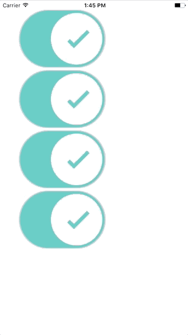
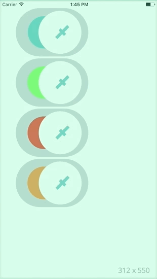
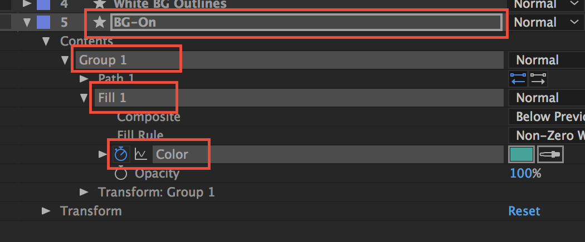
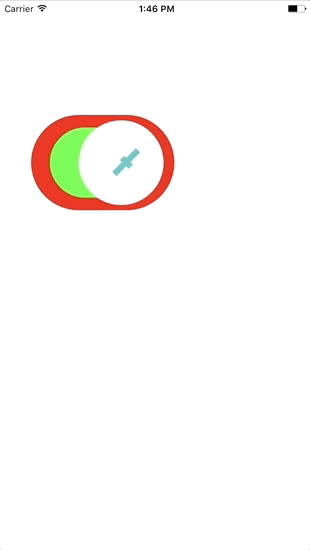

# Lottie for iOS, macOS (and [Android](https://github.com/airbnb/lottie-android) and [React Native](https://github.com/airbnb/lottie-react-native))
[](https://cocoapods.org/pods/lottie-ios)[](https://cocoapods.org/pods/lottie-ios)[](https://cocoapods.org/pods/lottie-ios)
>  ==**Announcement**==: As of 3.0 Lottie has been completely rewritten in Swift 4.2! For Objective-C support please use Lottie 2.5.3. Read Migration doc [Here](/Documentation/MIGRATING.md).

Lottie is a mobile library for Android and iOS that natively renders vector based animations and art in realtime with minimal code.

Lottie loads and renders animations and vectors exported in the bodymovin JSON format. Bodymovin JSON can be created and exported from After Effects with [bodymovin](https://github.com/bodymovin/bodymovin), Sketch with [Lottie Sketch Export](https://github.com/buba447/Lottie-Sketch-Export), and from [Haiku](https://www.haiku.ai). 

For the first time, designers can create **and ship** beautiful animations without an engineer painstakingly recreating it by hand.
Since the animation is backed by JSON they are extremely small in size but can be large in complexity!
Animations can be played, resized, looped, sped up, slowed down, reversed, and even interactively scrubbed.
Lottie can play or loop just a portion of the animation as well, the possibilities are endless!
Animations can even be ***changed at runtime*** in various ways! Change the color, position or any keyframable value!
Lottie also supports native UIViewController Transitions out of the box!

Here is just a small sampling of the power of Lottie


## Contents

- [Installing Lottie](#installing-lottie)
- [Quick Start](#quick-start)
- [Animation Model](#animation-model)
	- [Loading Animation](#loading-animation)
- [Animation View](#animation-view)
	- [Supplying Images](#supplying-images)
	- [Playing Animations](#playing-animations)
	- [Animation Settings](#animation-settings)
	- [Using Markers](#using-markers)
	- [Dynamic Animation Properties](#dynamic-animation-properties)
	- [Adding Views to Animations](#adding-views-to-animations)
- [Image Provider](#image-provider)
	- [BundleImageProvider](#bundleimageprovider)
	- [FilepathImageProvider](#filepathimageprovider)
- [Animation Cache](#animation-cache)
	- [LRUAnimationCache](#lruanimationcache)
- [Value Providers](#value-providers)
	- [Primitives](#primitives)
	- [Prebuilt Providers](#prebuilt-providers)
- [Animated Control](#animated-control)
- [Animated Switch](#animated-switch)
- [Animated Button](#animated-button)
- [Examples](#examples)
	- [Changing Animations at Runtime](#changing-animations-at-runtime)
- [Supported After Effects Features](#supported-after-effects-features)
- [Alternatives](#alternatives)
- [Why is it Called Lottie?](#why-is-it-called-lottie)
- [Contributing](#contributing)
- [Issues or Feature Requests?](#issues-or-feature-requests)
## Installing Lottie
Lottie supports [CocoaPods](https://cocoapods.org/) and [Carthage](https://github.com/Carthage/Carthage) (Both dynamic and static). Lottie is written in ***Swift 4.2***.
### Github Repo

You can pull the [Lottie Github Repo](https://github.com/airbnb/lottie-ios/) and include the Lottie.xcodeproj to build a dynamic or static library.

### CocoaPods
Add the pod to your Podfile:
```ruby
pod 'lottie-ios'
```

And then run:
```ruby
pod install
```
After installing the cocoapod into your project import Lottie with 
```swift
import Lottie
```
### Carthage
Add Lottie to your Cartfile:
```
github "airbnb/lottie-ios" "master"
```

And then run:
```
carthage update
```
In your application targets “General” tab under the “Linked Frameworks and Libraries” section, drag and drop lottie-ios.framework from the Carthage/Build/iOS directory that `carthage update` produced.

[Back to contents](#contents)

## Quick Start

Lottie loads and renders animations and vectors exported in the bodymovin JSON format. Bodymovin JSON can be created and exported from After Effects with [bodymovin](https://github.com/bodymovin/bodymovin), Sketch with [Lottie Sketch Export](https://github.com/buba447/Lottie-Sketch-Export), and from [Haiku](https://www.haiku.ai). 
 
 Lottie-iOS looks to `UIImageView` for its API. The basic API is broken into two parts:
 - `Animation` - The backing model for an animation that is deserialized from a json file.
 - `AnimationView` - A `UIView` subclass responsible for loading and rendering the `Animation`

You can quickly load a Lottie animation with:
```swift
let starAnimationView = AnimationView(name: "StarAnimation")
```
Additionally you can choose to load an `AnimationView` without any animation, and set the animation later:
```swift
let starAnimationView = AnimationView()
/// Some time later
let starAnimation = Animation.named("StarAnimation")
starAnimationView.animation = starAnimation
```
You can load animations from a specific bundle, a filepath, or even asynchronously from a URL. Read more about loading animations [Here](#loading-animation)

After loading an animation it can be played with:
```swift
starAnimationView.play { (finished) in
	/// Animation finished
}
```
Read more about playing animations [Here](#playing-animations)

[Back to contents](#contents)
## Animation Model
The `Animation` model is the top level model object in Lottie. An `Animation` holds all of the animation data backing a Lottie Animation. `Animations` are deserialized from JSON.
Codable; see JSON schema [here](https://github.com/airbnb/lottie-web/tree/master/docs/json).

 `Animation` is also fully `codable`. ==Animations can be decoded, and encoded to JSON!==
 
### Loading Animation
There are a variety of ways to load an `Animation` on its own. Additionally you can load an animation while allocating an `AnimationView` through one of the convenience initializers on `AnimationView`.

Animations can be stored in an `AnimationCacheProvider`  to reduce the overhead of deserializing the same animations over and over. Read more [here](#animation-cache).
#
#### Loading from a Bundle
```swift
Animation.named(_ name: String, bundle: Bundle, subdirectory: String?, animationCache: AnimationCacheProvider?) -> Animation?
```
Loads an animation model from a bundle by its name. Returns `nil` if an animation is not found. 

Parameters:
: **name**: The name of the json file without the json extension. EG "StarAnimation"
: **bundle**: The bundle in which the animation is located. Defaults to `Bundle.main`
: **subdirectory**: A subdirectory in the bundle in which the animation is located. Optional.
: **animationCache**: A cache for holding loaded animations. Optional.

Example:
```swift
/// Load from the main bundle.
let animation = Animation("StarAnimation")
/// Load from a specific bundle/
let animation = Animation("StarAnimation", bundle: myBundle)
/// Load from a subdirectory in a bundle.
let animation = Animation("StarAnimation", subdirectory: "Animations")
/// Load with an animation cache.
let animation = Animation("StarAnimation", animationCache: LRUAnimationCache.sharedCache)
```
#
#### Loading from a Filepath
```swift
Animation.filepath(_ filepath: String, animationCache: AnimationCacheProvider?) -> Animation?
```
Loads an animation model from an absolute filepath. Returns `nil` if an animation is not found. 

Parameters:
: **filepath**: The absolute filepath of the animation to load. EG "/User/Me/starAnimation.json"
: **animationCache**: A cache for holding loaded animations. Optional.

Example:
```swift
let animation = Animation(filepathURL.path, animationCache: LRUAnimationCache.sharedCache)
```

[Back to contents](#contents)
## Animation View
`AnimationView` is a UIView (NSView on macOS) subclass that displays animation content. `AnimationView` offers a number of ways to load, play, and even change animations.

### Creating Animation Views
Animation views can be allocated with or without animation data. There are a handful of convenience initializers for initializing with animations. 

#
### Supplying Images
`AnimationView` uses `AnimationImageProvider` to retrieve the images for its animation.
An image provider can be supplied when the Animation View is initialized, or after by setting its `imageProvider` property. 
To force an AnimationView to reload its images call `reloadImages()` on the AnimationView.

Read more about `AnimationImageProvider` [here](#image-provider)

#
### Playing Animations
#### Time
There are several methods for playing animations, and portions of animations. Lottie describes Time in three ways:
 - Frame Time - Describes time in a frames per second format. `(Seconds * Framerate)` *eg: 0.5 second is FrameTime 12 when framerate is 24*.
 - Progress Time - Describes time in progress from 0 (the beginning of the animation timeline) to 1 (the end of the animation timeline).
 - Time - Describes time in seconds.

All three can be used to play and set time on an `AnimationView`
#
#### Basic Playing
```swift
AnimationView.play(completion: LottieCompletionBlock?)
```
Plays the animation from its current state to the end of its timeline. Calls the completion block when the animation is stopped.

Parameters:
: **completion**: A completion block that is called when the animation completes. The block will be passed `true` if the animation completes and `false` if the animation was interrupted. Optional.

Example:
```swift
starAnimationView.play { (finished) in
/// Animation stopped
}
```
#
#### Play with Progress Time
```swift
AnimationView.play(fromProgress: AnimationProgressTime?, toProgress: AnimationProgressTime, loopMode: LottieLoopMode?, completion: LottieCompletionBlock?)
```
Plays the animation from a `Progress Time` to a `Progress Time` with options.

Parameters:
: **fromProgress**: The start progress of the animation. If `nil` the animation will start at the current progress. (Optional)
: **toProgress**: The end progress of the animation.
: **loopMode**: The loop behavior of the animation. If `nil` the view's `loopMode` property will be used.  (Optional)
: **completion**: An optional completion closure to be called when the animation stops.  (Optional)

Example:
```swift
/// Play only the last half of an animation.
animationView.play(fromProgress: 0.5, toProgress: 1)
```
#
#### Play with Frame Time
```swift
AnimationView.play(fromFrame: AnimationProgressTime?, toFrame: AnimationFrameTime, loopMode: LottieLoopMode?, completion: LottieCompletionBlock?)
```
Plays the animation from a `Frame Time` to a `Frame Time` with options.

Parameters:
: **fromFrame**: The start frame of the animation. If `nil` the animation will start at the current frame. (Optional)
: **toFrame**: The end frame of the animation.
: **loopMode**: The loop behavior of the animation. If `nil` the view's `loopMode` property will be used.  (Optional)
: **completion**: An optional completion closure to be called when the animation stops.  (Optional)

Example:
```swift
/// Play from frame 24 to 48 of an animation.
animationView.play(fromFrame: 24, toFrame: 48)
```
#
#### Play with Marker Names
```swift
AnimationView.play(fromMarker: String?, toMarker: String, loopMode: LottieLoopMode?, completion: LottieCompletionBlock?)
```
Plays the animation from a named marker to another marker. Markers are point in time that are encoded into the Animation data and assigned a name.
Read more on Markers [here](#using-markers)
==NOTE==: If markers are not found the play command will exit. 

Parameters:
: **fromMarker**: The start marker for the animation playback. If `nil` the animation will start at the current progress. (Optional)
: **toMarker**: The end marker for the animation playback.
: **loopMode**: The loop behavior of the animation. If `nil` the view's `loopMode` property will be used.  (Optional)
: **completion**: An optional completion closure to be called when the animation stops.  (Optional)

Example:
```swift
/// Play from frame 24 to 48 of an animation.
animationView.play(fromMarker: "ftue1_begin", toMarker: "ftue1_end")
```
#
#### Stop
```swift
AnimationView.stop()
```
Stops the currently playing animation, if any. The animation view is reset to its start frame. The previous animation's completion block will be closed with `false`
Example:
```swift
animationView.stop()
```
#
#### Pause
```swift
AnimationView.pause()
```
Pauses the animation in its current state. The previous animation's completion block will be closed with `false`
Example:
```swift
animationView.pause()
```
#
### Animation Settings
`AnimationView` has a variety of settings for controlling playback, and visual state.
#
#### Content Mode
```swift
/// iOS
var AnimationView.contentMode: UIViewContentMode { get set }
/// MacOS
var AnimationView.contentMode: LottieContentMode { get set }
```
Describes how the AnimationView should resize and scale its contents.

Options:
: **scaleToFill**: Animation scaled to fill the bounds of AnimationView. The animation will be stretched if the aspect of the AnimationView is different than the Animation.
: **scaleAspectFit**: Animation will be scaled to fit the AnimationView while preserving its aspect ratio.
: **scaleAspectFill**: Animation will be scaled to fill the AnimationView while preserving its aspect ratio.
: **topLeft**: Animation will not be scaled.
#
#### Background Behavior
```swift
var AnimationView.backgroundBehavior: LottieBackgroundBehavior { get set }
```
Describes the behavior of an AnimationView when the app is moved to the background. (iOS only)

The default is `.pause`

Options:
: **stop**: Stop the animation and reset it to the beginning of its current play time. The completion block is called.
: **pause**: Pause the animation in its current state. The completion block is called.
: **pauseAndRestore**: Pause the animation and restart it when the application moves back to the foreground. The completion block is stored and called when the animation completes.
#
#### Loop Mode
```swift
var AnimationView.loopMode: LottieLoopMode { get set }
```
Sets the loop behavior for `play` calls. Defaults to `playOnce`
Options:
: **playOnce**: Animation is played once then stops.
: **loop**: Animation will loop from end to beginning until stopped.
: **autoReverse**: Animation will play forward, then backwards and loop until stopped.
: **repeat(amount)**: Animation will loop from end to beginning up to *amount* of times.
: **repeatBackwards(amount)**: Animation will play forward, then backwards a *amount* of times.
#
#### Is Animation Playing
```swift
var AnimationView.isAnimationPlaying: Bool { get set }
```
Returns `true` if the animation is currently playing, `false` if it is not.
#
#### Should Rasterize When Idle
```swift
var AnimationView.shouldRasterizeWhenIdle: Bool { get set }
```
When `true` the animation view will rasterize its contents when not animating. Rasterizing will improve performance of static animations.
==Note:== this will not produce crisp results at resolutions above the animation's natural resolution.

Defaults to `false`
#
#### Respect Animation Frame Rate
```swift
var AnimationView.respectAnimationFrameRate: Bool { get set }
```
When `true` the animation will play back at the framerate encoded in the `Animation` model. When `false` the animation will play at the framerate of the device.

Defaults to `false`
#
#### Animation Speed
```swift
var AnimationView.animationSpeed: CGFloat { get set }
```
Sets the speed of the animation playback. Higher speed equals faster time.
Defaults to `1`
#
#### Current Progress
```swift
var AnimationView.currentProgress: AnimationProgressTime { get set }
```
Sets the current animation time with a Progress Time. Returns the current Progress Time, or the final Progress Time if an animation is in progress.
==Note==: Setting this will stop the current animation, if any.
#
#### Current Time
```swift
var AnimationView.currentTime: TimeInterval { get set }
```
Sets the current animation time with a TimeInterval. Returns the current TimeInterval, or the final TimeInterval if an animation is in progress.
==Note==: Setting this will stop the current animation, if any.
#
#### Current Frame
```swift
var AnimationView.currentFrame: AnimationFrameTime { get set }
```
Sets the current animation time with a Frame Time. Returns the current  Frame Time, or the final  Frame Time if an animation is in progress.
==Note==: Setting this will stop the current animation, if any.
#
#### Realtime Frame
```swift
var AnimationView.realtimeAnimationFrame: AnimationFrameTime { get }
```
Returns the realtime Frame Time of an AnimationView while an animation is in flight.
#
#### Realtime Progress
```swift
var AnimationView.realtimeAnimationProgress: AnimationProgressTime { get }
```
Returns the realtime Progress Time of an AnimationView while an animation is in flight.
#
#### Force Display Update
```swift
func AnimationView.forceDisplayUpdate()
```
Forces the AnimationView to redraw its contents.

#
### Using Markers
Markers are a way to describe a point in time by a key name. Markers are encoded into animation JSON. By using markers a designer can mark playback points for a developer to use without having to worry about keeping track of animation frames. If the animation file is updated, the developer does not need to update playback code.

Markers can be used to [playback sections of animation](#play-with-marker-names), or can be read directly for more advanced use. Both `Animation` and `AnimationView` have methods for reading Marker Times.

#
#### Reading Marker Time
```swift
/// Animation View Methods
AnimationView.progressTime(forMarker named: String) -> AnimationProgressTime?
AnimationView.frameTime(forMarker named: String) -> AnimationFrameTime?
/// Animation Model Methods
Animation.progressTime(forMarker named: String) -> AnimationProgressTime?
Animation.frameTime(forMarker named: String) -> AnimationFrameTime?
```
Each method returns the time for the marker specified by name. Returns nil if the marker is not found.
#
### Dynamic Animation Properties
Nearly all properties of a Lottie animation can be changed at runtime using a combination of [Animation Keypaths](#animation-keypaths) and [Value Providers](#value-providers). Setting a ValueProvider on a keypath will cause the animation to update its contents and read the new Value Provider.
In addition, animation properties can be read using `Animation Keypaths`.

#
#### Setting Dynamic Properties
```swift
AnimationView.setValueProvider(_ valueProvider: AnyValueProvider, keypath: AnimationKeypath)
```
Sets a ValueProvider for the specified keypath. The value provider will be set on all properties that match the keypath.

Parameters
: **valueProvider**: The new value provider for the property.
: **keypath**: The keypath used to search for properties.

Example:
```swift
/// A keypath that finds the color value for all `Fill 1` nodes.
let fillKeypath = AnimationKeypath(keypath: "**.Fill 1.Color")
/// A Color Value provider that returns a reddish color.
let redValueProvider = ColorValueProvider(Color(r: 1, g: 0.2, b: 0.3, a: 1))
/// Set the provider on the animationView.
animationView.setValueProvider(redValueProvider, keypath: fillKeypath)
```
#
#### Reading Animation Properties
```swift
AnimationView.getValue(for keypath: AnimationKeypath, atFrame: AnimationFrameTime?) -> Any?
```
Reads the value of a property specified by the Keypath.
Returns nil if no property is found.

Parameters
: **for**: The keypath used to search for the property.
: **atFrame**: The Frame Time of the value to query. If nil then the current frame is used.

Example:
```swift
/// A keypath that finds the Position of `Group 1` in `Layer 1`
let fillKeypath = AnimationKeypath(keypath: "Layer 1.Group 1.Transform.Position")
let position = animationView.getValue(for: fillKeypath, atFrame: nil)
/// Returns Vector(10, 10, 0) for currentFrame. 
```
#
#### Logging Keypaths
```swift
AnimationView.logHierarchyKeypaths()
```
Logs all child keypaths of the animation into the console.

#
### Adding Views to Animations
Custom views can be added to AnimationViews. These views will animate alongside the animation.

#
#### Adding Subviews
```swift
AnimationView.addSubview(_ subview: AnimationSubview, forLayerAt keypath: AnimationKeypath)
```
Searches for the nearest child layer to the first Keypath and adds the subview to that layer. The subview will move and animate with the child layer. Furthermore the subview will be in the child layers coordinate space.
==Note==: if no layer is found for the keypath, then nothing happens.

Parameters
: **subview**: The subview to add to the found animation layer.
: **keypath**: The keypath used to find the animation layer.

Example:
```swift
/// A keypath that finds `Layer 1`
let layerKeypath = AnimationKeypath(keypath: "Layer 1")

/// Wrap the custom view in an `AnimationSubview`
let subview = AnimationSubview()
subview.addSubview(customView)

/// Set the provider on the animationView.
animationView.addSubview(subview, forLayerAt: layerKeypath)
```
#
#### Converting CGRect and CGPoint to Layers
```swift
/// Converts a rect
AnimationView.convert(_ rect: CGRect, toLayerAt keypath: AnimationKeypath) -> CGRect?
/// Converts a point
AnimationView.convert(_ point: CGPoint, toLayerAt keypath: AnimationKeypath) -> CGPoint?
```
These two methods are used to convert geometry from the AnimationView's coordinate space into the coordinate space of the layer found at Keypath.

If no layer is found, nil is returned

Parameters
: **point or rect**: The CGPoint or CGRect in the AnimationView's coordinate space to convert.
: **keypath**: The keypath used to find the layer.
#
[Back to contents](#contents)
## Image Provider
Image provider is a protocol that is used to supply images to `AnimationView`.

Some animations require a reference to an image. The image provider loads and provides those images to the `AnimationView`.  Lottie includes a couple of prebuilt Image Providers that supply images from a Bundle, or from a FilePath.

Additionally custom Image Providers can be made to load images from a URL, or to Cache images.

### BundleImageProvider
```swift
public class BundleImageProvider: AnimationImageProvider
```
An `AnimationImageProvider` that provides images by name from a specific bundle. The `BundleImageProvider` is initialized with a bundle and an optional searchPath.

```swift
/// Create a bundle that loads images from the Main bundle in the subdirectory "AnimationImages"
let imageProvider = BundleImageProvider(bundle: Bundle.main, searchPath: "AnimationImages")
/// Set the provider on an animation.
animationView.imageProvider = imageProvider
```
#
### FilepathImageProvider
```swift
public class FilepathImageProvider: AnimationImageProvider
```
An `AnimationImageProvider` that provides images by name from a specific local filepath.

```swift
/// Create a bundle that loads images from a local URL filepath.
let imageProvider = AnimationImageProvider(filepath: url)
/// Set the provider on an animation.
animationView.imageProvider = imageProvider
```
[Back to contents](#contents)
## Animation Cache

`AnimationCacheProvider` is a protocol that describes an Animation Cache. Animation Cache is used when loading `Animation` models. Using an Animation Cache can increase performance when loading an animation multiple times.

Lottie comes with a prebuilt LRU Animation Cache.

### LRUAnimationCache
An Animation Cache that will store animations up to `cacheSize`. Once `cacheSize` is reached, the least recently used animation will be ejected. The default size of the cache is 100.

LRUAnimationCache has a global `sharedCache` that is used to store the animations.

You may also call `LRUAnimationCache.sharedCache.clearCache()` to clear the cache.

[Back to contents](#contents)
## Value Providers
`AnyValueProvider` is a protocol that return animation data for a property at a given time. Every fame an `AnimationView` queries all of its properties and asks if their ValueProvider has an update. If it does the AnimationView will read the property and update that portion of the animation.

Value Providers can be used to dynamically set animation properties at run time.

### Primitives

ValueProviders work with a few Primitive data types. 

 - **Color**: A primitive that describes a color in R G B A (0-1)
 - **Vector1D**: A single float value.
 - **Vector3D**: A three dimensional vector. (X, Y, Z)
 
### Prebuilt Providers
Lottie comes with a handful of prebuilt providers for each Primitive Type. Each Provider can be initialized with a single value, or a block that will be called on a frame-by-frame basis.

Example
```swift

/// A Color Value provider that returns a reddish color.
let redValueProvider = ColorValueProvider(Color(r: 1, g: 0.2, b: 0.3, a: 1))

/// A keypath that finds the color value for all `Fill 1` nodes.
let fillKeypath = AnimationKeypath(keypath: "**.Fill 1.Color")
/// Set the provider on the animationView.
animationView.setValueProvider(redValueProvider, keypath: fillKeypath)

/// Later...
/// Changing the value provider will update the animation.
redValueProvider.color = Color(r: 0, g: 0.2, b: 1, a: 1)
```
[Back to contents](#contents)
## Animation Keypaths
`AnimationKeypath` is an object that describes a keypath search for nodes in the animation JSON. `AnimationKeypath` matches views and properties inside of `AnimationView` to their backing `Animation` model by name.

A keypath can be used to set properties on an existing animation, or can be validated with an existing `Animation`. `AnimationKeypath` can describe a specific object, or can use wildcards for fuzzy matching of objects. Acceptable wildcards are either "*" (star) or "**" (double star). Single star will search a single depth for the next object. Double star will search any depth.

An `AnimationKeypath` can be initialized with a dot-separated keypath, or with an array of keys. 

Keypath Examples:
```
/// Represents a specific color node on a specific stroke.
@"Layer.Shape Group.Stroke 1.Color"
```
```
/// Represents the color node for every Stroke named "Stroke 1" in the animation.
@"**.Stroke 1.Color"
```

Code Example:
```swift
/// A keypath that finds the color value for all `Fill 1` nodes.  
let fillKeypath =  AnimationKeypath(keypath:  "**.Fill 1.Color")
```

[Back to contents](#contents)
## Animated Control
Lottie comes prepacked with a two Animated Controls, `AnimatedSwitch` and `AnimatedButton`. Both of these controls are built on top of `AnimatedControl`

`AnimatedControl` is a subclass of `UIControl` that provides an interactive mechanism for controlling the visual state of an animation in response to user actions.

The `AnimatedControl` will show and hide layers depending on the current `UIControl.State` of the control.

Users of `AnimationControl` can set a Layer Name for each `UIControl.State`. When the state is change the `AnimationControl` will change the visibility of its layers.

[Back to contents](#contents)
## Animated Switch


An interactive switch with an 'On' and 'Off' state. When the user taps on the switch the state is toggled and the appropriate animation is played.

Both the 'On' and 'Off' have an animation play range associated with their state.

To change the play range for each state use:
```swift
/// Sets the play range for the given state. When the switch is toggled, the animation range is played.
public func setProgressForState(fromProgress: AnimationProgressTime,
		toProgress: AnimationProgressTime,
		forState onState: Bool)
```
[Back to contents](#contents)
## Animated Button


An interactive button that plays an animation when pressed.
The `AnimatedButton` can play a variety of time ranges for different `UIControl.Event`.  Play ranges are set using either:
```swift
/// Set a play range with Progress Time.
public func setPlayRange(fromProgress: AnimationProgressTime, 
		toProgress: AnimationProgressTime, 
		event: UIControl.Event)
/// Set a play range with Marker Keys.
public func setPlayRange(fromMarker fromName: String, 
		toMarker toName: String, 
		event: UIControl.Event)
```
Once set the  animation will automatically play when the event is triggered.

Example:
```swift
/// Create a button.
let twitterButton = AnimatedButton()
twitterButton.translatesAutoresizingMaskIntoConstraints = false
/// Set an animation on the button.
twitterButton.animation = Animation.named("TwitterHeartButton", subdirectory: "TestAnimations")
/// Turn off clips to bounds, as the animation goes outside of the bounds.
twitterButton.clipsToBounds = false
/// Set animation play ranges for touch states
twitterButton.setPlayRange(fromMarker: "touchDownStart", toMarker: "touchDownEnd", event: .touchDown)
twitterButton.setPlayRange(fromMarker: "touchDownEnd", toMarker: "touchUpCancel", event: .touchUpOutside)
twitterButton.setPlayRange(fromMarker: "touchDownEnd", toMarker: "touchUpEnd", event: .touchUpInside)
view.addSubview(twitterButton)
```
[Back to contents](#contents)
## Examples

### Changing Animations at Runtime

Lottie can do more than just play beautiful animations. Lottie allows you to **change** animations at runtime.

### Say we want to create 4 toggle switches.


It's easy to create the four switches and play them:

```swift
let animationView = AnimationView(name: "toggle");
self.view.addSubview(animationView)
animationView.play()

let animationView2 = AnimationView(name: "toggle");
self.view.addSubview(animationView2)
animationView2.play()

let animationView3 = AnimationView(name: "toggle");
self.view.addSubview(animationView3)
animationView3.play()

let animationView4 = AnimationView(name: "toggle");
self.view.addSubview(animationView4)
animationView4.play()

```
### Now lets change their colors


```swift

/// A Color Value provider that returns a reddish color.
let redValueProvider = ColorValueProvider(Color(r: 1, g: 0.2, b: 0.3, a: 1))
/// A Color Value provider that returns a reddish color.
let orangeValueProvider = ColorValueProvider(Color(r: 1, g: 1, b: 0, a: 1))
/// A Color Value provider that returns a reddish color.
let greenValueProvider = ColorValueProvider(Color(r: 0.2, g: 1, b: 0.3, a: 1))


let keypath = AnimationKeypath(keypath: "BG-On.Group 1.Fill 1.Color")
animationView2.setValueProvider(greenValueProvider, keypath: keypath)

animationView3.setValueProvider(redValueProvider, keypath: keypath)

animationView4.setValueProvider(orangeValueProvider, keypath: keypath)
```
The keyPath is a dot separated path of layer and property names from After Effects.
AnimationView provides `func logHierarchyKeypaths()` which will recursively log all settable keypaths for the animation.


"BG-On.Group 1.Fill 1.Color"

### Now lets change a couple of properties


Lottie allows you to change **any** property that is animatable in After Effects. 

[Back to contents](#contents)

#
## Supported After Effects Features

| **Shapes** | **2.5.2** | **3.0** |
|:--|:-:|:-:|
| Shape | 👍 | 👍 |
| Ellipse | 👍 | 👍 |
| Rectangle | 👍 | 👍 |
| Rounded Rectangle | 👍 | 👍 |
| Polystar | 👍 | 👍 |
| Group | 👍 | 👍 |
| Repeater | 👍 | ⛔️ |
| Trim Path (individually) | ⛔️ | 🎉 |
| Trim Path (simultaneously) | ❗️ | 🎉 |
| **Renderable** | **2.5.2** | **3.0** |
| Fill  | 👍 | 👍 |
| Stroke | 👍 | 👍 |
| Radial Gradient |               👍 | 👍 |
| Linear Gradient |               👍 | 👍 |
| Gradient Stroke |               ⛔️ | 🎉 |
| **Transforms** | **2.5.2** | **3.0** |
| Position |                      👍 | 👍 |
| Position (separated X/Y) |      ❗️ | 👍 |
| Scale |                         👍 | 👍 |
| Skew |                         ⛔️ | 🎉 |
| Rotation |                      👍 | 👍 |
| Anchor Point |                  👍 | 👍 |
| Opacity |                       👍 | 👍 |
| Parenting |                     👍 | 👍 |
| Auto Orient |                   ⛔️ | ⛔️ |
| **Interpolation** | **2.5.2** | **3.0** |
| Linear Interpolation |          ❗️ | 🎉 |
| Bezier Interpolation |          👍 | 👍 |
| Hold Interpolation |            👍 | 👍 |
| Spatial Bezier Interpolation |  ❗️ | 🎉 |
| Rove Across Time |              👍 | 👍 |
| **Masks** | **2.5.2** | **3.0** |
| Mask Path |                     👍 | 👍 |
| Mask Opacity |                  👍 | 👍 |
| Add |                           👍 | 👍 |
| Subtract |                      ❗️ | 🎉 |
| Intersect |                     ⛔️ | 🎉 |
| Lighten |                       ⛔️ | ⛔️ |
| Darken |                        ⛔️ | ⛔️ |
| Difference |                    ⛔️ | ⛔️ |
| Expansion |                     ⛔️ | ⛔️ |
| Feather |                       ⛔️ | ⛔️ |
| **Mattes** | **2.5.2** | **3.0** |
| Alpha Matte |                   👍 | 👍 |
| Alpha Inverted Matte |          ⛔️ | 🎉 |
| Luma Matte |                    ⛔️ | ⛔️ |
| Luma Inverted Matte |           ⛔️ | ⛔️ |
| **Merge Paths** | **2.5.2** | **3.0** |
| Merge |                        ⛔ | ⛔ | 
| Add | ⛔ | ⛔ |
| Subtract | ⛔ | ⛔ |
| Intersect | ⛔ | ⛔ | 
| Exclude Intersection | ⛔ | ⛔ | 
| **Layer Effects** | **2.5.2** | **3.0** |
| Fill |                          ⛔️ | ⛔️ |
| Stroke |                        ⛔️ | ⛔️ |
| Tint |                          ⛔️ | ⛔️ |
| Tritone |                       ⛔️ | ⛔️ |
| Levels Individual Controls |    ⛔️ | ⛔️ |
| **Text** | **2.5.2** | **3.0** |
| Glyphs |                         ⛔️ | ⛔️ | 
| Fonts |                          ⛔️ | 🎉 |
| Transform |                      ⛔️ |🎉 | 
| Fill |                           ⛔️ | 🎉 | 
| Stroke |                         ⛔️ | 🎉 | 
| Tracking |                       ⛔️ | 🎉 | 
| Anchor point grouping |         ⛔️ | ⛔️ | 
| Text Path |                     ⛔ | ⛔️ | 
| Per-character 3D |              ⛔ | ⛔️ | 
| Range selector (Units) |        ⛔ | ⛔️ | 
| Range selector (Based on) |     ⛔ | ⛔️ | 
| Range selector (Amount) |       ⛔ | ⛔️ | 
| Range selector (Shape) |        ⛔ | ⛔️ |
| Range selector (Ease High) |    ⛔ | ⛔️ |
| Range selector (Ease Low)  |    ⛔ | ⛔️ |
| Range selector (Randomize order) | ⛔ | ⛔️ |
| expression selector |           ⛔ | ⛔️ | 
| **Other** | **2.5.2** | **3.0** | 
| Expressions |                   ⛔️ | ⛔️ |
| Images |                        👍 | 👍 |
| Precomps |                      👍 | 👍 |
| Time Stretch |                  ⛔️ | 👍 |
| Time remap |                   ⛔️ | 👍 |
| Markers | ⛔️ | 🎉 |

[Back to contents](#contents)
## Alternatives
1. Build animations by hand. Building animations by hand is a huge time commitment for design and engineering across Android and iOS. It's often hard or even impossible to justify spending so much time to get an animation right.
2. [Facebook Keyframes](https://github.com/facebookincubator/Keyframes). Keyframes is a wonderful new library from Facebook that they built for reactions. However, Keyframes doesn't support some of Lottie's features such as masks, mattes, trim paths, dash patterns, and more.
2. Gifs. Gifs are more than double the size of a bodymovin JSON and are rendered at a fixed size that can't be scaled up to match large and high density screens.
3. Png sequences. Png sequences are even worse than gifs in that their file sizes are often 30-50x the size of the bodymovin json and also can't be scaled up.

[Back to contents](#contents)
## Why is it Called Lottie?
Lottie is named after a German film director and the foremost pioneer of silhouette animation. Her best known films are The Adventures of Prince Achmed (1926) – the oldest surviving feature-length animated film, preceding Walt Disney's feature-length Snow White and the Seven Dwarfs (1937) by over ten years.
[The art of Lotte Reineger](https://www.youtube.com/watch?v=LvU55CUw5Ck&feature=youtu.be)

[Back to contents](#contents)
## Contributing
Contributors are more than welcome. Just upload a PR with a description of your changes.
To get ramped up on how Lottie-iOS works, read through the [Contributor Documentation](/Documentation/CONTRIBUTOR.md)

[Back to contents](#contents)
## Issues or Feature Requests?
File github issues for anything that is broken. Be sure to check the [list of supported features](#supported-after-effects-features) before submitting.  If an animation is not working, please attach the After Effects file to your issue. Debugging without the original can be very difficult. Lottie is developed and maintained by [Brandon Withrow](mailto:brandon@withrow.io). Feel free to reach out via [email](mailto:brandon@withrow.io) or [Twitter](https://twitter.com/theWithra)

[Back to contents](#contents)
